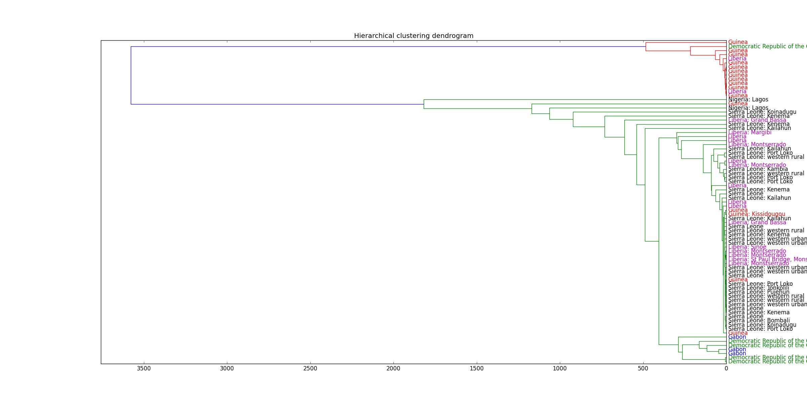
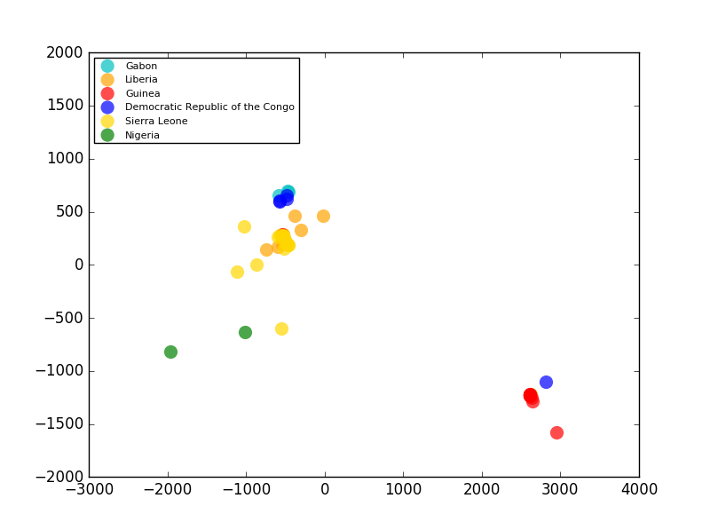
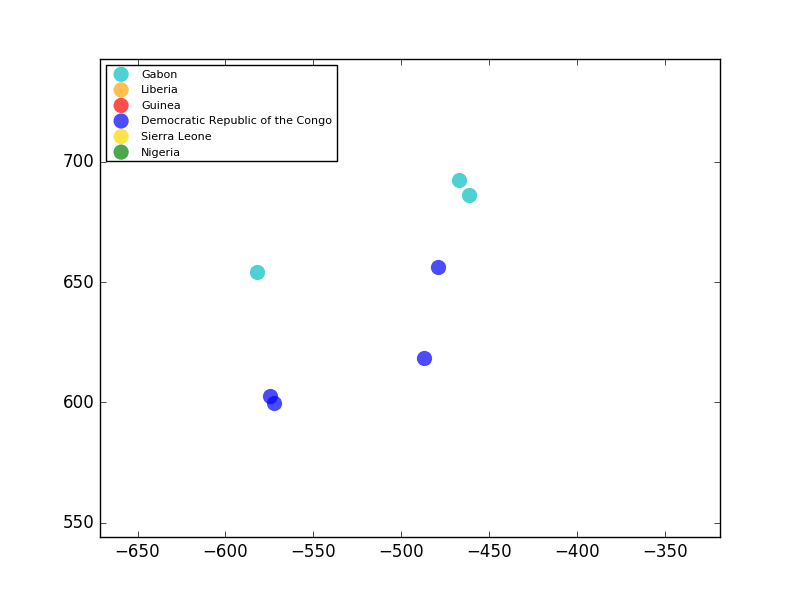
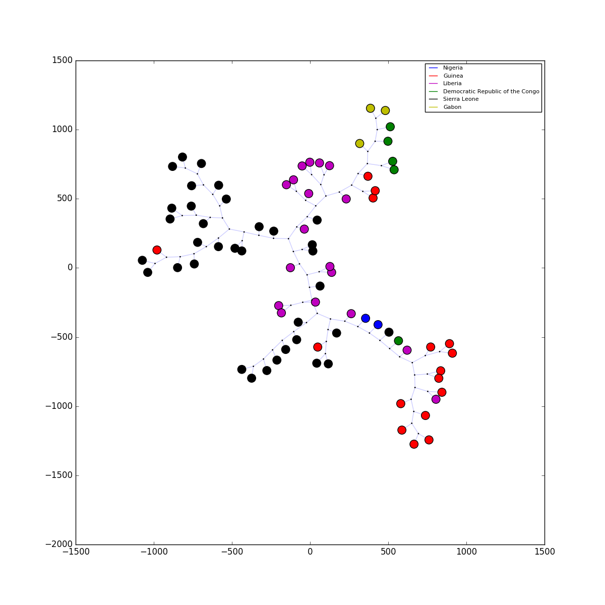

# Evolucija virusov
Skupina ub201617_beta

# Uvod

Cilj naloge je bil identificirati gene, ki vsebujejo informacije o tem kako se virus razvija med izbruhom,
opraviti globalno poravnano (global alignment) na izbranih genih in izračunati matriko razdelje urejanja (edit distance).
S pomočjo znanih algoritmov gručenja (Hierarchical clustering, Neighbour joining, Multidimensional scaling ...) 
je bilo potrebno poročati o zanimivih ugotovitvah. Enega od teh algoritmov je bilo potrebno tudi impelemntirati.

# Metode in Rezultati

## Izračun matrike razdalje urejanja (edit distance)

Na začetku identificiramo gene in njihove velikosti. Ugotovimo da virus Ebole vsebuje 7 genov, 4 so krajši (VP24, VP30, VP35 in VP40), 2 srednje velika (GP in NP) ter en dolg gen (L). Krajši štirje so dolgi približno 1500 bp, srednji približno 2500 do 3000 bp in najdalši približno 7000 bp. 

Nato naključno izberemo 2 vzorca in na vsakem genu z uporabo dinamičenga programiranja opravimo globalno poravnano (global alignment). Ker nas zanima samo razdelja urejanje (edit distance), ne potrebujemo traceback-a. Ugotovili smo da za izračun enega para genov potrebujemo nekaj minut. Izračuna za najdelši gen nismo mogli izvesti na računalniku s 8GB spomina.

Ignorirali smo gen L zaradi omejitve spomina. Za pohitritev izračunov smo uporabili multiprocesiranje. Za izračun celotne matrike je bilo potrebno približno 20 ur. 

## Hierarhično gručenje

Za ocenjevanje podobnosti med različnimi genomi virusa ebole smo uporabili hierarhično gručenje.
Pri tem smo razdaljo med dvema genomoma definirali kot vsoto ocen poravnav (alignment score) med
5 geni iz vsakega genoma, za katere smo izračunali oceno poravnave.
Pri računanju razdalje med gručami pa smo uporabili povprečno razdaljo, tj. razdalja med dvema gručama je
povprečje razdalj med pari primerkov iz obeh gruč.

Postopek hierarhičnega gručenja smo sprogramirali sami, za izris dendrograma pa uporabili funkcijo iz
paketa scipy.

<!---->

Na dendrogramu za vsak genom označimo državo, v kateri se je pojavil. Tako vidimo, da so v zgornji (redeči) skupini virusi opazno različni od
ostalih, pojavljajo pa se predvsem v Gvineji.
Opazimo še skupino zelo podobnih virusov, ki se pojavljajo predvsem v Sierri Leone, pa tudi v Gvineji in Liberiji. Sklepamo,
da so ti virusi v Gvinejo in Liberijo prišli iz Sierre Leone.
Zanimivo je tudi, da virusi iz Demokratične republike Kongo niso podobni nobenemu virusu iz sosednjih držav.

## MDS

Poleg dendrograma, smo za vizualizacijo izračunanih razdalj uporabili tudi MDS (Večrazsežnostno lestvičenje).
MDS podatke o podobnosti/različnosti preslika v razdalje med točkami v geometričnem prostoru. Da je vizualizacija kar se
da jasna, smo razdalje med genomi preslikali v 2-dimenzionalni prostor. Pozicije (koordinate) genomov smo izračunali z
uporabo funkcije mainfold.MDS iz knjižnjice scikit-learn. Začetne pozicije točk smo izbrali naključno, nato pa razdalje
med njimi optimizirali z metričnim MDS.

Dobljene točke smo prikazali na scatterplotu (razsevni diagram) in jih obarvali glede na državo pojavitve.
Barve smo izbrali tako, da so države, ki so si geografsko blizu, podobno obarvane.

Opazimo tesno gručo genomov iz Gabona in Demokratične republike Kongo. 

V bližini tudi skupino zelo podobnih genomov
iz Sierre Leone, v bližini katere se nahajajo tudi vzorci iz bližnjih Liberie in Gvineje.
Opazno različna od vseh prej omenjenih skupin pa je gruča genomov, pretežno iz Gvineje, ki je obarvana rdeče in izrisana
na povsem drugi strani diagrama.
Med obravnavanimi genomi je tudi nekaj vzorcev iz Nigerije, ki pa glede na MDS ne spadajo v nobeno od identificiranih
gruč - verjetno tudi zaradi geografske oddaljenosti.

## Neighbour joining

Neighbour joining je metoda gručenja za izgradnjo genetskih dreves. Metodo sta ustvarila Naruya Saitou in Masatoshi Nei leta 1987.
Običajno se metoda uporablja na drevesih, ki temeljijo na DNA ali proteinskih podatkih. Metoda zahteva razdalje med pari, da lahko zgradimo drevo.
Končno drevo nam prikaže kateri pari so si med seboj najbolj dobobni. 

Na zgornjem drevesu vidimo, da so primerki iz enaki držav praviloma blizu med seboj. Naprimer vsi trije primerki iz Gabona so si med seboj zelo blizu.
Enako velja tudi za oba iz Nigerije. Iz Dokratične republike Congo so 4je primerki zelo skupaj in so si med seboj podobni s primerki iz Gabona, eden pa malo izstopa
in je na grafu daleč stran. Najbolj razpršeni so primerki iz Liberije in Sierre Leone, kar je po svoje razumljivo, saj jih je največ.

